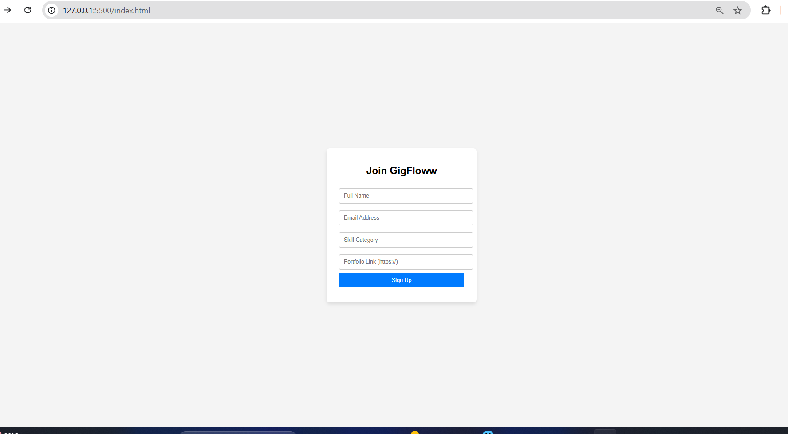

# 🚀 GigFloww — Sign-Up Form with Validation

A simple and responsive **Sign-Up Form** designed for **GigFloww**.  
This form allows gig workers to join the platform with basic client-side validation using **HTML, CSS, and JavaScript**.

---

## 💡 Features

✅ Fully responsive layout  
✅ Fields for: Name, Email, Skill Category, Portfolio Link  
✅ Real-time input validation (HTML + JavaScript)  
✅ User-friendly error messages  
✅ Confirmation message on successful submission  
✅ Smooth redirect simulation after sign-up  

---

## 🧑‍💻 Tech Stack

- **HTML5**  
- **CSS3**  
- **Vanilla JavaScript (ES6)**  

---

## 📸 Preview

  


---

## ⚙️ How to Run

1. Clone or Download this repository.
2. Open the `index.html` file in your browser.
3. Fill the form with valid details.
4. Hit **Sign Up** — validation will check for:
   - Empty fields.
   - Valid email format.
   - Valid portfolio URL.
5. Success? You’ll see:  
   `Sign-Up Successful! Redirecting...`

---

## 📌 Folder Structure

```
/GigFloww-Signup-Form
├── index.html
├── style.css
└── script.js
```

---

## 📝 Future Scope

- Backend Integration with APIs.
- Store user data into a database.
- Add advanced form animations.

---

## 🙌 Author

Made with ❤️ for the **GigFloww Internship Assignment**.  

